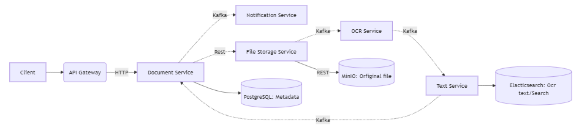

# Описание
Система управления документами на основе микросервисной архитектуры. Реализованные функции: 
- загрузка нескольких изображений или одного pdf файла
- поиск документа по содержимому (ищет по распознанному тексту)
- редактирование метаданных документа
- отправляет уведомления об истечении срока дейсвтия, если такой указан
- удаление документа
- операции удаления и добавления идемпотентны  
Программа в процессе написания. Фронтенд написан в целях демонстрации работы бекенда.  
# Структура
## Document service
Отвечает за работу с метаданными документа.
## File storage service 
Отвечает за хранение оригиналов в облачном хранилище. В данном случае используется MinIO.
## OCR service
Отвечает за распознавания текста на фото и сканах.
## Text service
Отвечает за хранение текста и поиск по нему. Использует для этого Elasticsearch.
## Notification service
Отправляет уведомления пользователю. В данный момент выводит сообщения в консоль для эмитации работы
## Взаимодействие между сервисами
Взаимодействие осуществляется как асинхронно для обработки файла, так и синхронно для
получения детальной информации о документе: оригинал и распознанный текст.  
Для асинхронного взаимодействия используются Kafka и WebClient (для более тяжёлых файлов).  
Для синхронного взаимодействия используется Spring RestClient.  
## Граф примерной структуры микросервисов и их связей
Пунктирной линией отображены асинхронные связи, тогда как сплошной линией отображены синхронные

## Планируется
Привести структуру кода в порядок, выделив классы, там, где это необходимо.  
Добавить паттерн Saga.  
Добавить обработку текстовых PDF файлов.
Написать интеграционные и unit-тесты